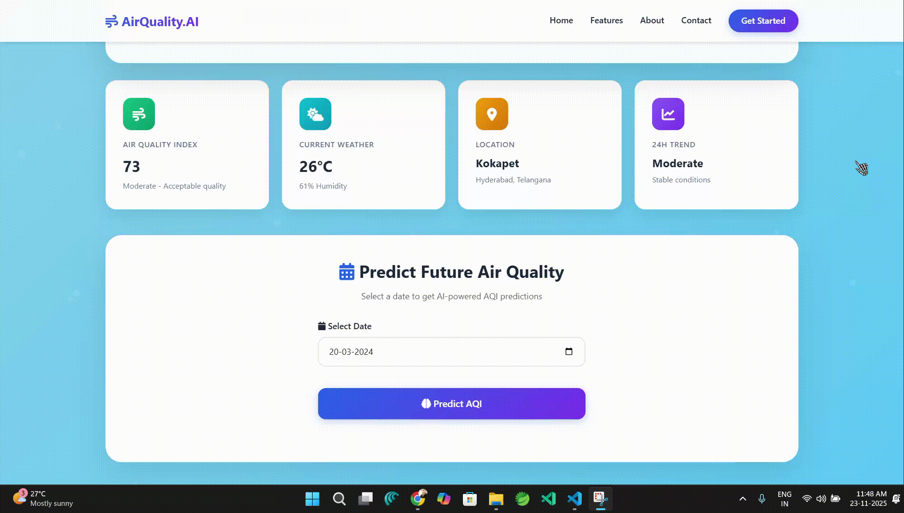

# Project HackSavy | 2024
# Air Quality Index Prediction Web App

## Hackathon Context
This project was developed as part of **HackSavy-24**, a 24-hour national level hackathon at Mahatma Gandhi Institute of Technology, Hyderabad.

## Project Overview
Our team built a predictive AI web application to forecast air quality levels (AQI and PM2.5) using historical data and machine learning. The goal is to provide cities and communities with a tool to implement timely pollution control measures, considering factors like traffic, industrial activity, and weather conditions.

## Features
- **Time-Series Forecasting:** Uses Facebook Prophet to predict PM2.5 and AQI for any date in the dataset or future range.
- **Interactive Dashboard:** Modern UI with Bootstrap, custom CSS, and Plotly charts for data visualization.
- **Dynamic Date Picker:** Select any date within the available data range; date picker updates automatically based on the dataset.
- **AQI Category & Color Coding:** Results are color-coded and categorized (Good, Moderate, Unhealthy, etc.) with health implications.
- **Model Performance Metrics:** Displays MAE, RMSE, and MAPE for model evaluation.
- **Error Handling:** Gracefully handles missing or out-of-range dates.
- **Clean Codebase:** Organized structure with templates, static files, and virtual environment for dependencies.

## Impact & Use Cases
- **Environmental Monitoring:** Helps cities and researchers track and forecast air quality trends.
- **Public Health:** Enables timely alerts and recommendations for sensitive groups.
- **Policy & Planning:** Supports data-driven decisions for pollution control and urban planning.

## Tech Stack
- Python (Flask, Pandas, Numpy, Prophet, Plotly, scikit-learn)
- HTML, CSS, Bootstrap
- Jinja2 Templating
- Data Science (Time Series Forecasting)

## Screenshots

Below are some screenshots from the project and hackathon participation. Replace the image links with your actual screenshots later.

### Hackathon Certificate
[View Certificate](https://drive.google.com/file/d/18rTIj5Qrra5atlGU1yu0GIC_fqZHWenh/view?usp=sharing)

### Web App Demo Video


## How to Run
1. **Clone the repository:**
   ```bash
   git clone <your-repo-url>
   cd Hackathon2/Hackathon
   ```
2. **Set up the virtual environment:**
   ```bash
   python -m venv .venv
   source .venv/Scripts/activate  # On Windows
   pip install -r requirements.txt
   ```
3. **Run the app:**
   ```bash
   python app.py
   ```
4. **Open in browser:**
   Visit `http://127.0.0.1:5000` and use the dashboard.

## File Structure
```
Hackathon2/
├── Hackathon/
│   ├── app.py
│   ├── dataSet.csv
│   ├── static/
│   │   ├── style.css
│   │   └── style1.css
│   ├── templates/
│   │   ├── date.html
│   │   └── output.html
│   └── .venv/
├── README.md
```

## Screenshots
_Add screenshots of your dashboard and prediction results here._

## Contributing
Pull requests are welcome! For major changes, please open an issue first to discuss what you would like to change.

## License
MIT

---
**Project Mayhem | 2024**
